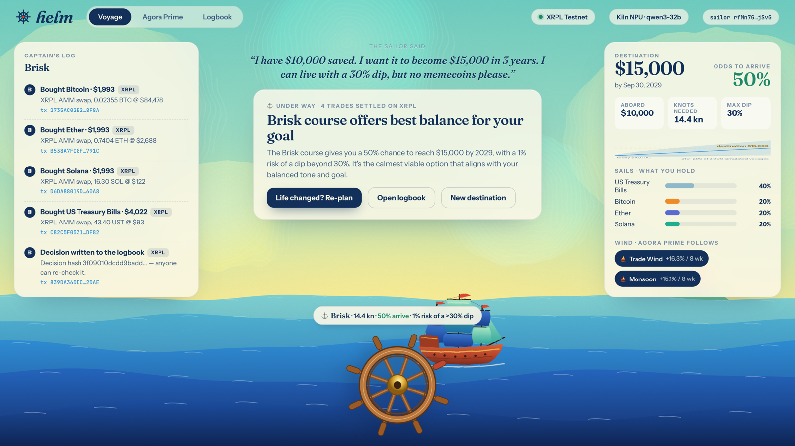

# helm

> **Declared function:** helm is an asset‑management agent that turns a plain‑words money goal into a charter the user signs on XRPL Testnet, then either invests it across 9 tokenized asset classes (T‑bills, 국채, stocks, REITs, gold, BTC/ETH/SOL, memecoins) inside the signed budget, dip limit and exclusions, re‑plans when the budget or deadline changes, or declines on‑chain with computed counter‑offers when the goal can't be met.

**GWDC 2026 Korea · FuriosaAI × Bricksum bonus track · Challenge A: "Build a Financial Service Powered by AI Agents and Blockchain."**
Inference is the **Kiln API** (Bricksum NPU cloud). The chain is the **XRPL Testnet** (tokenized assets, AMM pools, memo'd records). Solo team: THE ZONE (Minsung Park).

| | |
|---|---|
| 🎬 Demo video (≤ 3 min) | [`docs/helm-demo.mp4`](docs/helm-demo.mp4) |
| 📑 Deck (10 pages) | [`docs/helm-deck.pdf`](docs/helm-deck.pdf) |
| ⛓ Live accounts (XRPL Testnet) | <!--ACCOUNTS-->sailor [`rfMn7Gwk…`](https://testnet.xrpl.org/accounts/rfMn7GwkqsBoLizfMdpVczZuBhGvVkjSvG) · vault [`rDVdhJ2x…`](https://testnet.xrpl.org/accounts/rDVdhJ2xp7bWikTGjZw9bx1H7uueiAGdyv) · mint [`rJVZH5H3…`](https://testnet.xrpl.org/accounts/rJVZH5H3VJWwGoCycwcERyzDX8H1nXMysR) · exchange [`rKoYQebv…`](https://testnet.xrpl.org/accounts/rKoYQebvLddx1PsXPEWnadwHz3XhGAZZ1Z)<!--/ACCOUNTS--> |
| ✅ Verify without a key | `npm install && npm run verify` re‑hashes every recorded decision and compares it with the ledger (read‑only) |
| 🧾 Proof | [Track A runs](#3-track-a-runs-on-xrpl-testnet), [Kiln calls per flow](#5-kiln-api-per-flow-tokens-energy), `data/voyages/*.json` (full event logs) |



---

## 1. User and problem

**User.** A saver with a real goal (a house deposit, tuition, early retirement) who already holds a little of everything and never knows *when to switch*.

**Problem.** The winning asset class changes every year. In helm's own 5‑year snapshot, the best performer was T‑bills in 2022 (+1%, while SOL fell 93%), Solana in 2023 (+609%), Dogecoin in 2024 (+389%) and gold in 2025 (+60%, while DOGE fell 56%). People pick one style, ride it into a storm and sell at the bottom. Advisors pick a static mix and never say "this goal is impossible".

**helm's answer.** The core product is **Agora Prime**, an agent that switches strategy (it *tacks*) toward whichever strategy captains have the wind, sized to your dip limit. Around it sits a navigator that tells you the real odds before a dollar moves, and a ledger that records every move.

## 2. What the AI does, and what stays in code

| Step | Who | Tokens |
|---|---|---|
| **intake**: your words → `{stake, target, months, maxDrawdown, exclude, tone}` | **LLM (Kiln)** | yes |
| validate the numbers; compute the deadline from `months` (models are bad at date math) | code | 0 |
| **charter**: the sailor signs the terms as an XRPL transaction (memo `helm/charter`) | chain | 0 |
| **read back**: helm reads the charter from the sailor's ledger history and acts on *that* | chain → code | 0 |
| **chart**: Agora Prime backtest on real prices for 8 risk settings, 3,000 block‑bootstrap voyages each → odds of arriving, odds of breaking the dip limit, p10/p50/p90, and counter‑offers | code | 0 |
| **navigate**: choose one *viable* course (or decline) for this person's tone, explain it in plain words | **LLM (Kiln)** | yes |
| **guard**: SAIL only if a viable course exists (odds ≥ 50%, dip‑breach risk ≤ 20%), never an excluded asset, 2% slippage cap | code | 0 |
| **explanation check**: every % the model tells the person must be a real figure for the decision taken, otherwise it is corrected and logged (models borrow another course's odds) | code | 0 |
| **trim sails**: read vault holdings + AMM prices from XRPL, sell first, then buy, as `OfferCreate` (IOC) swaps with memo `helm/trim` | code → chain | 0 |
| **record**: the decision (or decline + counter‑offers) + SHA‑256 decision hash, memo `helm/log` / `helm/decline` | code → chain | 0 |

The LLM *chooses and explains*. Every number it sees and every number we act on comes from code. It never holds a key and cannot skip the guard (see `src/agent.js → navigate()`: model says SAIL with no viable course → forced DECLINE; model picks a non‑viable course → calmest viable course; model quotes a wrong % → corrected. Every override is logged in the voyage and shown in the captain's log).

## 3. Track A runs on XRPL Testnet

All three runs are **live, end‑to‑end**: Kiln inference plus real XRPL Testnet transactions. They were recorded from the UI in the demo video. Full event logs, with every Kiln call and every tx, are in [`data/voyages/`](data/voyages).

<!--RUNS-->
### R1 · normal voyage

> “I have $10,000 saved. I want it to become $15,000 in 3 years. I can live with a 30% dip, but no memecoins please.”

**Parsed goal:** $10,000 → $15,000 by 2029-09-30, max dip 30%, excluded DOG, tone balanced. Needs 14.4%/yr.  
**Decision: SAIL · Brisk (σ 0.35)** · 50% odds of arriving · Prime follows Trade Wind + Monsoon · vault after: $9,996  
**Navigator said:** “The Brisk course gives you a 50% chance to reach $15,000 by 2029, with a 1% risk of a dip beyond 30%. It's the calmest viable option that aligns with your balanced tone and goal.”

| # | Step | By | Detail | Proof |
|---|---|---|---|---|
| 1 | intake | Kiln `qwen3-32b` | 299→73 tokens (1 reasoning), 1758 ms, ≤316.4 J | `chat-fbcffccd6e614f0abf12c80a60a8c70d` |
| 2 | charter | sailor | signed terms (memo `helm/charter`) | [`2FF5062E86D7…`](https://testnet.xrpl.org/transactions/2FF5062E86D797F292A9D41DF141EB135A4778F4C2B16D54A639917889D31521) |
| 3 | read back | helm | charter found in sailor's ledger history, ledger #21151491 | — |
| 4 | chart | code | 8 courses × 3,000 voyages, 0 tokens | — |
| 5 | navigate | Kiln `qwen3-32b` | SAIL σ 0.35 · 848→128 tokens, 3564 ms, ≤641.5 J | `chat-77113a04e12f434f80fec733c06087c0` |
| 6 | board | sailor → vault | $10,000 hUSD (memo `helm/board`) | [`DB506B60ECFC…`](https://testnet.xrpl.org/transactions/DB506B60ECFC0E592D2571D9EC6AB55FA70391103D530B31F059F1AEA72F12AF) |
| 7 | trim | vault ⇄ AMM | BUY BTC $1,993 (0.023554 BTC) | [`2735AC02B25B…`](https://testnet.xrpl.org/transactions/2735AC02B25B62310822B52C73A81D0ACE9F33F4CA4BD5348BE75C728FD58F8A) |
| 8 | trim | vault ⇄ AMM | BUY ETH $1,993 (0.74037 ETH) | [`B538A7FC8FBA…`](https://testnet.xrpl.org/transactions/B538A7FC8FBA9D856A11D1B8A393CC87CDE0D5B832D3151B2B83B57AB93C791C) |
| 9 | trim | vault ⇄ AMM | BUY SOL $1,993 (16.298 SOL) | [`D6DA88019DA0…`](https://testnet.xrpl.org/transactions/D6DA88019DA0B61278E5D9A1AF475A88BA396096583A44B3ED629EFFE00160A8) |
| 10 | trim | vault ⇄ AMM | BUY UST $4,022 (43.402 UST) | [`C82C5F053156…`](https://testnet.xrpl.org/transactions/C82C5F05315642F4BCFBFC3B9E6AB835A30D30063CEC3E04E73FD2153812DF82) |
| 11 | record | vault | SAIL + decision hash `3f09010dcdd9badd…` (memo `helm/log`) | [`839DA36DDC86…`](https://testnet.xrpl.org/transactions/839DA36DDC86E1A059C328758E60B13172FFCCFE97E5403B7146A099F9582DAE) |

### R2 · re-run: the budget changed

> “Good news — I got a bonus and I am adding $3,000. Same goal: $15,000, same date. I would rather sleep well now.”

**Parsed goal:** $13,000 → $15,000 by 2029-09-30, max dip 30%, excluded DOG, tone cautious. Needs 4.9%/yr.  
**Decision: SAIL · Anchored (σ 0.04)** · 76% odds of arriving · Prime follows Trade Wind + Monsoon · vault after: $13,010  
**Navigator said:** “We'll take the Anchored course, giving you a 76% chance to reach your goal with no risk of a dip beyond 30%. This is the calmest option, matching your cautious tone and bonus boost.”  
**Guard:** explanation said 82% — not a figure for this decision; corrected to 76%

| # | Step | By | Detail | Proof |
|---|---|---|---|---|
| 1 | intake | Kiln `qwen3-32b` | 341→54 tokens (1 reasoning), 2396 ms, ≤431.3 J | `chat-a9bb497d625c4b44b73e0549148f57c0` |
| 2 | charter | sailor | signed terms (memo `helm/amend`) | [`9D58D0C63547…`](https://testnet.xrpl.org/transactions/9D58D0C63547518F9BCC2CD589E47BE663A3B1DD50C692F6BBDAB03DC6A764BE) |
| 3 | read back | helm | charter found in sailor's ledger history, ledger #21151509 | — |
| 4 | chart | code | 8 courses × 3,000 voyages, 0 tokens | — |
| 5 | navigate | Kiln `qwen3-32b` | SAIL σ 0.04 · 854→126 tokens, 3445 ms, ≤620.1 J | `chat-6794498cfb1a4dc08a3a4ff3517b6775` |
| 6 | board | sailor → vault | $3,004 hUSD (memo `helm/board`) | [`F98D501EA4C0…`](https://testnet.xrpl.org/transactions/F98D501EA4C043A98E1D617423DB7DD976CB45952E6760CC5E2BB0403E3C5F3A) |
| 7 | trim | vault ⇄ AMM | SELL ETH $1,695 (0.63030 ETH) | [`B0A3A7304438…`](https://testnet.xrpl.org/transactions/B0A3A730443803F83B6A21BE33C76FBDC2A5D10585F9481FB63A59C217C66703) |
| 8 | trim | vault ⇄ AMM | SELL BTC $1,695 (0.020052 BTC) | [`AB3DF3E3CA89…`](https://testnet.xrpl.org/transactions/AB3DF3E3CA8943773DA3CD7B7403EE93672E6E6DE0ADC225F44FE3AF690447FE) |
| 9 | trim | vault ⇄ AMM | SELL SOL $1,695 (13.875 SOL) | [`4462B1534452…`](https://testnet.xrpl.org/transactions/4462B1534452712CD88171A1CB60CAAB3AA3B5AB08C3F30837FF69F9D569D5E6) |
| 10 | trim | vault ⇄ AMM | BUY UST $8,084 (87.015 UST) | [`629181768627…`](https://testnet.xrpl.org/transactions/629181768627B89E37555551925593A217D9CFDADCBA808804684591671AD60B) |
| 11 | record | vault | SAIL + decision hash `b73ecae4ca93ad92…` (memo `helm/log`) | [`3E8D05C7BFDD…`](https://testnet.xrpl.org/transactions/3E8D05C7BFDD969E83FB70351A118D148393FA1E018044E0BBE6D253E1B992DF) |

### R3 · re-run: a goal that can't be met

> “Turn $10,000 into $100,000 by next October. I cannot stomach losing more than 15%.”

**Parsed goal:** $10,000 → $100,000 by 2027-09-30, max dip 15%, tone bold. Needs 900.0%/yr.  
**Decision: DECLINE** · best course odds 0% · counter‑offers: $10,600 by the same date (even odds); $100,000 not reachable within 25 years at this dip limit · **no money moved**  
**Navigator said:** “Reaching $100,000 from $10,000 by next October would require a 900% annual return, which is not achievable with any viable course while staying within your 15% dip limit. A more realistic target, like $10,600, has a 50% chance of success with a low-risk course.”

| # | Step | By | Detail | Proof |
|---|---|---|---|---|
| 1 | intake | Kiln `qwen3-32b` | 285→58 tokens (1 reasoning), 2731 ms, ≤491.6 J | `chat-9a785284c2b24ea8b8dad21ec8809b19` |
| 2 | charter | sailor | signed terms (memo `helm/charter`) | [`F414F8D9EED7…`](https://testnet.xrpl.org/transactions/F414F8D9EED786A3472EA02E3BB5C16615AD67CB89C1B19B1005672E7FAA3B66) |
| 3 | read back | helm | charter found in sailor's ledger history, ledger #21151527 | — |
| 4 | chart | code | 8 courses × 3,000 voyages, 0 tokens | — |
| 5 | navigate | Kiln `qwen3-32b` | DECLINE · 790→148 tokens, 3118 ms, ≤561.2 J | `chat-8ac0f164af4c41d6bc737c8907f5fffa` |
| 6 | record | vault | DECLINE + decision hash `3b70dd7a5414d768…` (memo `helm/decline`) | [`BD08D81FE39F…`](https://testnet.xrpl.org/transactions/BD08D81FE39FE63B95D8DAEDAF63F1F18DFE93CB6C9D9E11C3BCFFE457213CBD) |


<!--/RUNS-->

**What changes between runs, and how you can verify it:**
- **R1 → R2 (new budget).** The sailor adds $3,000 with the same target and date. The amended charter is a new on‑chain record. helm re‑reads the vault's *on‑chain* holdings, finds it now needs fewer "knots", picks a calmer course and **tacks**: it sells crypto and buys T‑bills (the SELL rows above). Least risk that still gets there.
- **R3 (goal can't be met).** The same sailor re‑runs helm with harsher conditions (10× in 12 months, 15% dip limit). That needs ~900%/yr, and every course has 0% odds. helm **declines**. **No money moves** (there is no `board` tx). The decline and the code‑computed counter‑offers are written on‑chain.

## 4. How the chain is used: what the agent reads, writes and settles

| | What | Where |
|---|---|---|
| **reads** | the sailor's signed charter (`account_tx` + memo decode) · vault balances (`account_lines`) · live pool prices (`amm_info`) | `src/chain.js` |
| **writes** | `helm/charter`, `helm/amend` (sailor) · `helm/log`, `helm/decline` with decision hash (vault) | AccountSet + Memo |
| **settles** | `helm/board` (sailor → vault, hUSD) · `helm/trim` swaps against 9 AMM pools (hUSD ↔ UST, KTB, SPX, RET, GLD, BTC, ETH, SOL, DOG) | Payment, OfferCreate |

The testnet world (`npm run setup`) has four accounts. A **mint** tokenizes 9 asset classes plus a testnet dollar (hUSD). An **exchange** seeds one AMM pool per asset at the **latest real weekly close** (for example BTC $84,458). The **sailor** is you. The **vault** is the only account helm trades from. **Anyone can audit a decision:** the Logbook page's *verify* button (or `GET /api/verify?tx=<hash>`) re‑hashes the stored decision JSON and compares it with the `dh` field on the ledger.

## 5. Kiln API: per flow, tokens, energy

<!--KILN-->
| Flow | Calls | Prompt tokens | Completion tokens | Reasoning tokens | Avg latency | Energy (est., 1 card) |
|---|---|---|---|---|---|---|
| **intake** | 3 | 925 | 185 | 3 | 2295 ms | 1239 J |
| **navigate** | 3 | 2492 | 402 | 3 | 3376 ms | 1823 J |
| chart · guard · sizing · swaps · records | — | 0 | 0 | 0 | code | 0 J |
| **total, 3 runs** | **6** | | | | | **3.06 kJ** (4,004 tokens) |

<details><summary>Every Kiln call (id, flow, tokens, latency)</summary>

| time (UTC) | run | flow | model | id | in→out | ms |
|---|---|---|---|---|---|---|
| 2026-09-29T20:03:20.562Z | R1 | intake | qwen3-32b | `chat-fbcffccd6e614f0abf12c80a60a8c70d` | 299→73 | 1758 |
| 2026-09-29T20:03:29.660Z | R1 | navigate | qwen3-32b | `chat-77113a04e12f434f80fec733c06087c0` | 848→128 | 3564 |
| 2026-09-29T20:04:19.513Z | R2 | intake | qwen3-32b | `chat-a9bb497d625c4b44b73e0549148f57c0` | 341→54 | 2396 |
| 2026-09-29T20:04:27.899Z | R2 | navigate | qwen3-32b | `chat-6794498cfb1a4dc08a3a4ff3517b6775` | 854→126 | 3445 |
| 2026-09-29T20:05:20.111Z | R3 | intake | qwen3-32b | `chat-9a785284c2b24ea8b8dad21ec8809b19` | 285→58 | 2731 |
| 2026-09-29T20:05:34.601Z | R3 | navigate | qwen3-32b | `chat-8ac0f164af4c41d6bc737c8907f5fffa` | 790→148 | 3118 |

</details>

<!--/KILN-->

- **Model.** The brief asks for `gpt-oss-120b`. On 2026‑09‑30 Kiln answers `404 model_not_found` for it, and `GET /v1/models` serves `qwen3-32b` and `deepseek-v4.1-flash`. helm probes `gpt-oss-120b` first and falls back to `qwen3-32b` (see `src/kiln.js`). Set `KILN_MODEL` to switch the moment it's served.
- **Less inference by design.** Each voyage makes exactly **2 LLM calls**, with no agent loop. Qwen3's `/no_think` keeps reasoning tokens at ~1 per call. The Monte Carlo (24,000 voyages for the chart, plus the counter‑offer search on declines), the guard, trade sizing and all 7–9 chain transactions are code (0 tokens). A weekly "watch" can re‑run Prime in code and only wake the LLM when the plan changes (roadmap).
- **Energy (stated assumption).** Kiln exposes no power telemetry. We report an **estimate per call = FuriosaAI RNGD card TDP (180 W) × measured wall‑clock latency**, assuming one 180 W card serves the call alone (batched serving shares that power across many requests, so real per‑request energy is lower; a multi‑card deployment would raise it proportionally). Latency is measured per call. The watt figure is an assumption, overridable with `NPU_WATTS`.

## 6. Agora Prime: why this is an agent, not a portfolio

Six rule‑based **captains** (`src/fleet.js`) sail 4½ years of real weekly prices (Apr 2022 → Sep 2026, after 0.2% swap costs):

| Captain | Style | Growth | Worst dip |
|---|---|---|---|
| Harbor | T‑bills + Korea 10Y | 1.06× | −13% |
| Lighthouse | stocks / bonds / REITs / gold | 1.36× | −22% |
| Ballast | inverse‑volatility, 6 classes | 1.20× | −1% |
| Trade Wind | cross‑asset momentum, top 3 | 2.14× | −37% |
| Monsoon | BTC/ETH/SOL above 20‑week average | 2.44× | −43% |
| Corsair | SOL + memecoin, 4‑week momentum | 2.91× | −55% |
| **★ Agora Prime, Full sail** | follows the top‑2 captains by 8‑week momentum, tacks only on an 8‑pt lead, sizes sail by ex‑ante volatility | **2.62×** | **−28%** |
| **★ Agora Prime, Fresh breeze** | same captains, less sail | 1.71× | −19% |

**The game rule is your dip limit.** Cross it and you capsize, which is exactly when real people panic‑sell. At a 30% limit, Corsair, Monsoon and Trade Wind all capsize. Prime finishes first at 2.62×, ahead of every captain that stays afloat. See it live on the **Agora Prime** tab.

**Honest caveats.** Prime's three parameters (8‑week window, top‑2, 8‑pt tack margin) were picked from a small sweep over this same window, so this is in‑sample, and out‑of‑sample seasons are on the roadmap. The Monte Carlo resamples Prime's own weekly returns in 8‑week blocks and does not model regime change. Testnet tokens are priced at real closes but are not the real assets. This is not investment advice.

## 7. Built before vs. during the event

- **Everything in this repository was written during the GWDC hackathon window (Sep 28–30, 2026)**: the engine, agent, chain layer, UI, video tooling, deck and README. No code was copied from earlier projects.
- **Git history:** the repo was created at the event (Sep 30, 03:24 KST), the code was developed locally over the following hours and pushed in two commits (engine + UI, then proof + docs). There is no earlier history because there is no earlier code.
- **Concept lineage (disclosed):** the idea of strategy "captains" competing, with a meta‑agent following the winners ("Agora Prime"), comes from the team's earlier product thinking. helm is a new implementation.
- **Third‑party:** `xrpl` (npm), Google Fonts, the Kiln API, and Yahoo Finance weekly prices (snapshot in `data/market.json`, refetch with `npm run market`).

## 8. Run it

```bash
npm install                 # one dependency: xrpl
cp .env.example .env        # KILN_API_KEY=sk-bk-...  (Kiln console → API keys)
npm run check               # fleet backtest + self-checks (no network)
npm run setup               # fund 4 testnet accounts, tokenize 9 assets, seed 9 AMM pools (~5 min)
npm start                   # http://localhost:4800  → type a goal, press "Chart the course"
npm run voyages             # or: the 3 Track A runs from the CLI (R1 normal, R2 budget, R3 decline)
```

The UI also replays the recorded testnet voyages (buttons "R1 · R2 · R3" under the goal box), so you can browse without a Kiln key. The Logbook tab always reads the ledger live.

```
src/market.js      real weekly prices for 9 asset classes → data/market.json
src/fleet.js       6 captains, Agora Prime, Monte Carlo odds (pure code, self-check)
src/agent.js       the voyage: intake (LLM) → charter → read back → chart → navigate (LLM) → guard → swaps → record
src/kiln.js        Kiln client: model probe/fallback, retries, per-flow tokens + energy bound
src/chain.js       XRPL: tokens, AMM reads, swaps, memo records, logbook reader
src/setup-chain.js testnet world (mint, exchange + 9 AMM pools, sailor, vault)
src/server.js      web app + API (live voyage stream, regatta, logbook, verify)
web/               the helm UI (vanilla JS, SVG, canvas; no build step)
scripts/           film.mjs (drives the real UI and records the demo), cut.mjs, fill-docs.mjs
```

## 9. Roadmap

A weekly code‑only watch that tacks automatically, with the LLM waking only on change. Real tokenized T‑bill funds and stock/REIT tokens. Prediction‑market and yield captains. An open captain marketplace, where outside strategies race and earn when Prime follows them. KRW rails.
